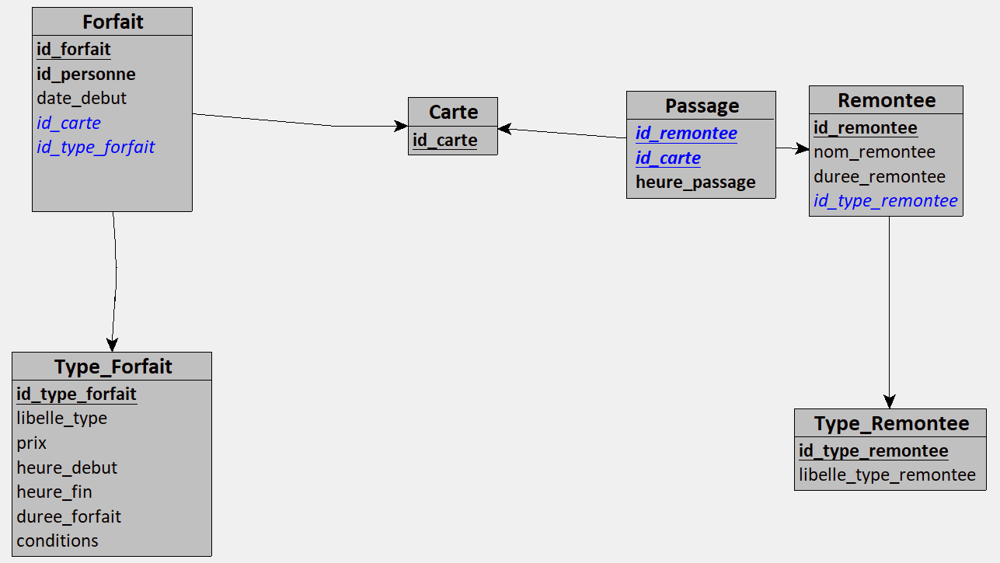

# Projet de Base de Données (Master 1 SSD)

Les données utilisées sont celles d'une station de ski.

## Objectifs

### 1) Créer les tables et leurs contraintes

[tables.sql](https://github.com/hugochauvet/Projet_BDD_stationski/blob/main/tables.sql)

### 2) Alimenter les tables

[alimentation.sql](https://github.com/hugochauvet/Projet_BDD_stationski/blob/main/alimentation.sql)

### 3) Réaliser les requêtes

[requetes.sql](https://github.com/hugochauvet/Projet_BDD_stationski/blob/main/requetes.sql)

1) Quel est le dernier forfait valide correspondant à un identifiant de carte donné (exemple : carte n°1) ?
2) Quels sont les noms des remontées de type ‘télésiège’ ?
3) Quels sont les remontées de type ’télésiège’ empruntées avec le forfait n°1 ?
4) Quelles sont les noms des remontées non empruntées avec le forfait n°2 ?
5) Pour chaque type de forfait, quel a été le nombre de forfaits vendus ?
6) Combien de forfaits ont été utilisés sur toutes les remontées de la station ?
7) Quelles sont les cartes qui ont été les plus ré-utilisées (c’est à dire associées au plus grand nombre de forfaits) ?
8) Quel est le nombre de passages enregistrés pour chaque remontée ?
9) Quel est, chaque jour, le nombre de passages enregistrés pour chaque remontée ?
10) Quelle est la remontée la plus fréquentée (où il y a eu le plus de passages) ?
11) Quel est le télésiège le moins fréquenté ?
12) Quel(s) forfait(s) a(ont) servi le plus de fois sur une journée ?
13) Quel est le chiffre d’affaire de la station (somme des prix des forfaits vendus) ?
14) Quel est le chiffre d’affaire de la station ventilé par mois (pour les forfaits à cheval sur 2 mois, on les compte par rapport à leur date de début de validité) ?

### 4) Créer des triggers et les tester

[triggers.sql](https://github.com/hugochauvet/Projet_BDD_stationski/blob/main/triggers.sql)

1) Une carte ne peut pas être associée à deux forfaits qui ont une période de validité commune.
2) Une carte ne peut pas être associée à un nouveau forfait si l’ancien n’est pas encore utilisé (date debut IS NULL)
3) On ne peut passer à une remontée mécanique que si le forfait est valide
4) On ne peut passer à une remontée mécanique que si le forfait n’est pas temporisé
