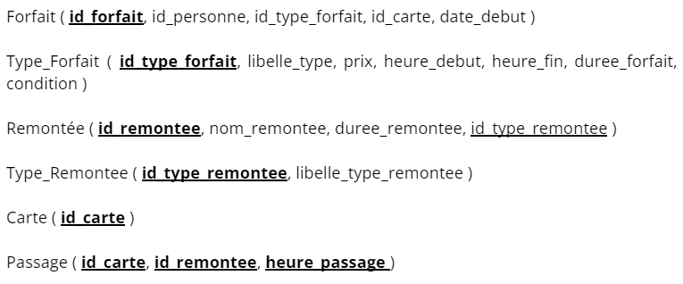

# Projet de Base de Données (Master 1 SSD)

## Objectifs

Ce projet est basé sur une base de données d'une station de ski. Le premier objectif était de trouver un schéma de données en 3ème forme normale.

Ensuite il a fallu identifié les différentes contraintes liées à nos données.

Tout d'abord pour toutes les clés étrangères il a fallu les définir avec "IS NOT NULL". Pour les chaines de caractères ont les limiter à 30 caractères (VARCHAR 30). Les variables de temps "heure_debut" et "heure_fin" sont codées en "TIME" tandis que heure de passage est en "TIMESTAMP" car il y a la date en plus de l'heure dans la variable. 