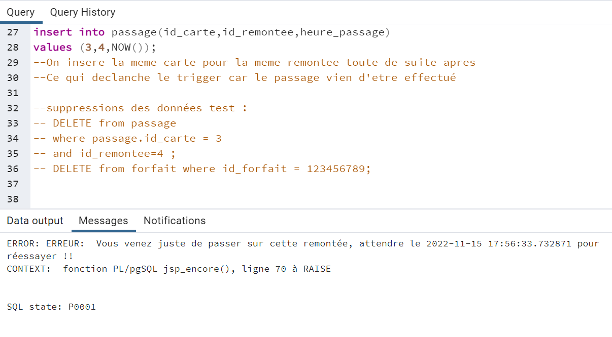

# Projet de Base de Données 

## Objectifs

L'objectif principal était de créer une base de données fonctionnelle pour des stations de ski, capable de gérer certaines contraintes imposées par le client. Pour ce faire, nous sommes partie d'une relation non normalisée, contenant un nombre important d'information sur les stations de ski. Nous avons du d'abord décomposer cette relation et normalisée nos differentes tables, afin de créer notre base. Une fois ceci réaliser, nous devions faire respecter les contraintes du client à la base de donnée. Regardons plus en détail le travail réalisé.

## Créations de la base et normalisation

Le premier objectif était de décomposer cette table en préservant les dépandance fonctionnelles et sans perte d'information. Le but étant d'obtenir plusieur tables qui respecte tous au minimum la 3ème forme normale. 

Nous avons d'abord du imaginer le modèle conceptuel des données (MCD), qui vas nous permettre d'identifier les principales entités à représenter, leurs relations et leurs attributs. Nous obtenons le MCD suivant :

Une fois le MCD terminé nous avons pu facilement en tirer le modèle logique de données (MLD), afin d'avoir une representation de toute nos tables, ainsi que leurs relations et leurs attributs. Voici le MLD que nous obtenons :

Nous pouvons voir grace au MLD que chaque tables respectent bien la 3ème forme normale. D'abord nous avons chacune des tables qui admettent une clé primaire, et tous les attributs les attributs contiennent une seule valeur pour chaque tuple. Ensuite, nous retrouvons bien que tous nos attributs non clé ne dépendent pas d'une partie de la clé primaire. Et enfin tous nos attributs n'appartenant pas à une clé ne dépandent pas d'un attribut non clé primaire. Tous ceci nous permet de valider la 3ème forme normale. Pour aller plus loin, nous pouvons admettre que toutes nos tables repectent la forme normale de Boyce-Codd, car tous les attributs non-clé ne sont pas source de dépendance fonctionnelle pour une partie de la clé.

La normalisation est maintenant terminer, nous connaissons les differentes tables qui composeront la base de données des stations de ski. Nous pouvons donc les créer et les allimenter grâce à la table de départ, et passer au deuxième objectif liée aux contraintes du client.

## Contrainte et déclancheur (Triggers)

Dans l'état actuel notre base de données contient certaines failles, qui ne peuvent être gérer directement. Le client nous a dicté ses contraintes qui lui semble les plus importantes. C'est celle-ci que nous avons traité puis testé. Voici les contraintes imposées :

1- Une carte ne peut pas être associée à deux forfaits qui ont une période de validité commune.  
2- Une carte ne peut pas être associée à un nouveau forfait si l’ancien n’est pas encore utilisé. 
3- On ne peut passer à une remontée mécanique que si le forfait est valide. 
4- On ne peut passer à une remontée mécanique que si le forfait n’est pas temporisé.

On peut diviser ces contraintes en deux groupes de deux. La 1 et 2 qui s'appliquerons à notre table forfait, et la 3 et 4 qui s'appliquerons à la table passage. Nous avons donc créés 2 triggers qui font appelles à des fonctions definis au préalable. C'est dans ces fonctions que l'on fait respecter les différentes contraites. Voyons plus en détails ces fonctions.

### Traitement des contraintes 1 et 2

Tout d'abord avec la fonction pour les deux premières contraintes. L'objectif va être de compter le nombre de forfait qui ne respecte pas nos contraintes par rapport au forfait que nous ajoutons.

On commence pas initialiser 3 variables:
<li> new_date_debut : La date de début du nouveau forfait.
<li> new_duree_forfait : La durée du forfait que nous voulons ajouter. 
<li> nb_forfaits : Le nombre de forfait qui ne respecte pas nos contraintes.
 
 
Nous devons ensuite attribuer des valeur à chacune de ses variables.

Pour la new_date_debut on s'assure que la valeur ne soit pas nulle. Si elle l'est, on lui donne comme valeur la date du jour actuel.

Pour la new_duree_forfait, on doit récupérer la valeur de celle-ci liée au type de forfait qu'on souhaite ajouter. La requête suivante vas donc chercher cette valeur, dans notre table type_de_forfait, pour l'id_type_forfait liée au forfait que nous ajoutons.

Une fois ces deux variables initialiser nous pouvons chercher le nb_forfaits.

Pour les cartes qui correspondent à la carte liée au forfait qu'on veut ajoute, on vas d'abord chercher si la periode de notre nouveau forfait chevauche une période d'un autre forfait déja présent dans notre tables forfait. Ceci vas nous permettre de verifier la première contrainte. 
Ensuite on cherche si la carte du nouveau forfait que l'on ajoute, correspond à un forfait avec une carte qui n'a pas encore été utilisé. Dans nos données cette information est spécifiée avec une date de débat à valeur null. Ici ces la contrainte deux qui vas etre pris en compte.  
On compte les forfaits qui respectent ces conditions, ce qui constitue notre variable nb_forfaits.

S'il y a un forfait ou plus qui sont compté, cela signifie que nos contraintes ne sont pas respecter. Une exception sera lever et signalera que la carte n'est pas disponible, en specifiant le numéro de la carte. 
La fonction maintenant terminé il faut verifier si elle fonctionne.

### Test des contraintes 1 et 2

Comme dit précédement les deux premières contrainte s'applique sur la table forfait. La vérification doit se faire avant l'insertion dans cette table.

On commence par essayer la contrainte 1. Pour cela, on ajoute dans un forfait qui n'est pas présent dans nos données. Ensuite on recommence l'opération en ajoutant un forfait avec le même numéro de carte, et en prenant soin de bien avoir une période qui chevauche le forfait précédement inserer. Ceci vas donc déclancher une exception informant que la carte n'est pas disponible. La contrainte 1 est bien respectée. Une fois cela réalisé on supprime le forfait utilisé pour le test.

Pour la contrainte 2 nous réalisons une opération assez similaire. On essaye d'ajouter deux forfaits avec le même numéro de carte, des période qui ne se chevauchent pas, pour eviter toute confusion avec la contrainte 1, et une date nulle pour le premier forfait. Le premier va réaliser l'insertion avec succes, cepandant le deuxième forfait vas déclancher l'exception liée a la fonction. La seconde contrainte est respecter on peut maintenant supprimer le forfait test, et passer aux contraintes 3 et 4 sur la table passage.

### Traitement des contraintes 3 et 4

Pour ces contraintes nous les traitons ensemble dans une même fonction, mais l'exception déclanchée et les variables utilisées varie d'un trigger à un autres. 

La variables new_heure_passage sera la seule utilisée pour la gestion des deux contraintes. Elle correspond à la date et l'heure de passage dans une remontée pour une carte. Si lors de l'insertion cette valeur est nulle, elle prendra la date et l'heure actuelle.

<I>Nb : Cette contrainte n'est pas forcément necessaire car l'heure de passage fait partie de la clée prmimaire de la table passage, et ne sera donc jamais nul.</I>

Maintenant regardons plus en détail le code qui sert à faire respecter la troisième contrainte.

On commence par déclarer les variables que nous utiliserons. Il y en a 4 :
<li>id_forfait_t
<li>date_fin
<li>heure_fin_t
<li>date_heure_fin

La variable id_forfait_t correspond a l'id_forfait du forfait le plus recent, c'est-à-dire avec la plus grande date de début dans notre table forfait, pour la cate que nous souhaitons ajouter.

On détermine ensuite la date de fin, ainsi que l'heure de fin, pour notre id_forfait_t. On vas récupérer ces valeurs dans la table type_forfait. L'heure de fin est donnée, tandis que la date de fin doit être calculé en ajoutant la durée du fofait, à la date de début du forfait correspondant à notre id_forfait_t.  
On concatène les variables date_fin et heure_fin_t pour obtenir la date_heure_fin, qui correspond à la date et l'heure d'expiration du forfait liée à la carte que nous essayons de faire passer.

Si cette date et heure d'expiration est inférieur à la date et l'heure de passage, alors on lève une exception qui spécifira que le forfait est expiré. La contrainte 3 est maintenant geré, regardons le code pour la contrainte 4.

Ici seulement 3 variables sont spécifiques pour cette contrainte. Ce sont les suivantes : 
<li>dernier_passage
<li>duree_remontee_t
<li>moment_interdit

On commence par chercher, pour la carte que l'ont souhaite ajouter, le dernier passage dans la remontée, que l'ont veux ajouter également. On stock le résultat dans la variable dernier_passage.  
On récupère ensuite la durée de la remontée que l'on veut ajouter qui correspond à la variable duree_remontee_t. 
Et on ajoute cette durée au dernier passsage pour avoir le moement ou le passage sera de nouveau autorisé. 

Si l'heure de passage est inférieur à ce moment, une exécution est levée signalant que le passage à cette remontée vient juste d'être effectué, précise le moment ou le passage pour de nouvent être réalisé. Ce qui fait respecter la contrainte 4. On peut maintenant tester si tout cela fonctionne correctement.

### Test des contraintes 3 et 4

Nos contraintes serons traiter avant l'insertion dans la table passage. 

Pour la contrainte 3 le test est très simple. Beaucoup de forfait dans notre base ont une période non valide, il suffit d'ajouter un passage pour une carte et une remontée. Ceci déclanchera l'exception, notre fonction pour le trigger 3 est fonctionnelle.

Pour la contrainte 4 nous devons procéder en plusieur étape. On vas d'abord ajouter un nouveau forfait qui aura une période valide. 

On vas ensuite insérer un nouveau passage, pour la carte et une remontée de ce forfait, avec l'heure et la date du moment comme heure de passage. Ceci ne vas pas déclancher l'exception de la contrainte 4.

On essaye tout de suite après de refaire la même insertion. Comme l'heure de passage aura changer ceci devrait être possible, mais la contrainte 4 n'étant pas respecter, ceci lève l'exception et indique quand le passage de cette remontée sera de nouveau possible pour cette carte. Nous avons bien réussi à gérer toutes les contraintes imposées par notre client. 

## Conclusion 

La base des station de ski est maintenant opérationnelle. Nous avons réussi à ciblé toutes les entités, les attributs, et les relations, qui permettent une gestion des données simplifiées. Nous avons ensuite schématisé et crée notre base. Une fois ce travaille réalisé, nous avons fait en sorte de gérer les contraintes imposée par le client, tout en les testants au préalable. Ce projet nous à permis de mettre en oeuvre un grand nombre de nos connaissances en SQL, en passant par la création de base et la gestion des données. Nous avons tout de même fait face à des difficultées, que ce soit par l'utilisation de PgAdmin en début de projet, ou pour l'interprétation des contraintes en langage SQL. Malgrés cela, nous avons réussi à aller au bout de nos idées, et obtenons un rendu complet répondant à l'ensembles des demandes du client.